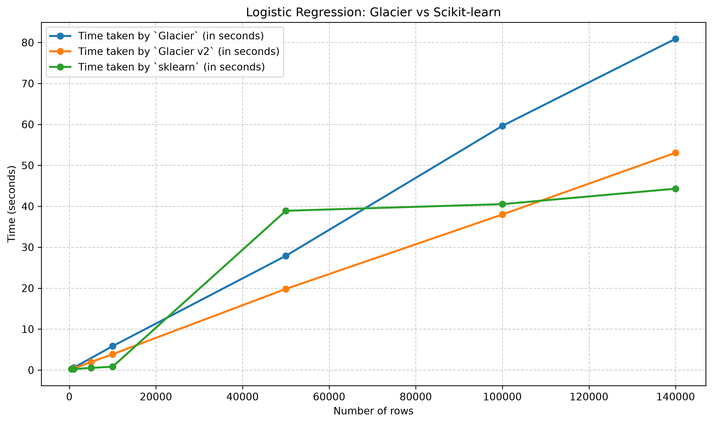

# Benchmark v2: Logistic Regression

## Dataset:
* The `Give Me Some Credit` dataset with various predetermined number of rows are used. 
* Number of columns in the dataset = 10

## Hyperparameters:
- alpha: 0.001 (not configurable in `Scikit-learn`)
- number of iterations: 2000

### Table
| Number of rows | Time taken by `Glacier` (in seconds) | Time taken by `Glacier v2` (in seconds) | Time taken by `sklearn` (in seconds) |
|:--------------:|:---------------------------------------:|:------------------------------------------:|:---------------------------------------:|
|      500       |                 0.2966                  |                   0.215                    |                  0.24                   |
|      1000      |                 0.5618                  |                   0.404                    |                 0.2584                  |
|      5000      |                    -                    |                   1.935                    |                 0.5123                  |
|     10000      |                 5.8355                  |                    3.87                    |                 0.8108                  |
|     50000      |                 27.8964                 |                   19.807                   |                 38.898                  |
|     100000     |                 59.6352                 |                   37.992                   |                 40.5179                 |
|     140000     |                 80.9204                 |                   53.072                   |                 44.2951                 |

### Graph

## Changes from primal iteration:
* Benchmark timings of `Glacier v2` and `sklearn` represent the average of 5 consecutive runs preceded by 5 warm-up runs, with device set to 
`Performance` mode and no other application running in the background.
* The hyperparameters `alpha` and `number of iterations` per training run are set constant for models trained on all 
mentioned dataset sizes.
